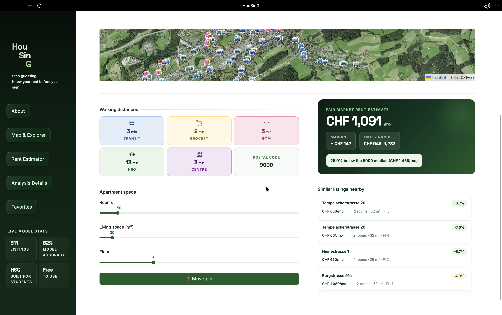
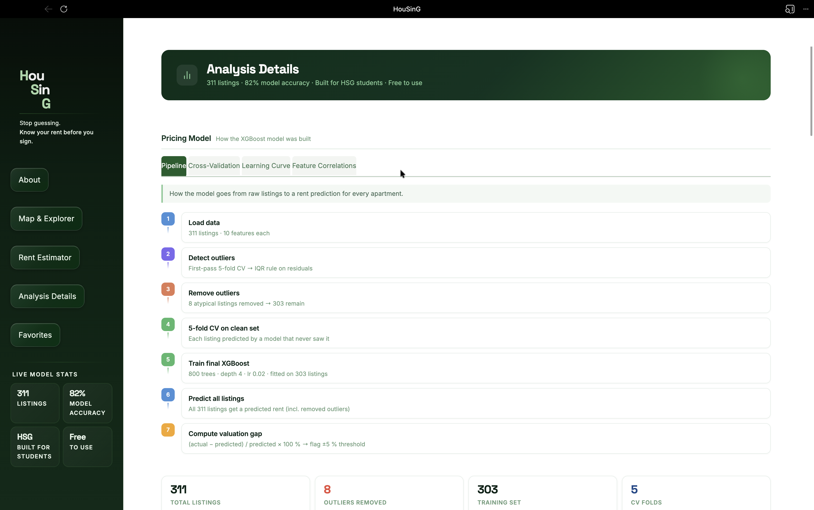

# St. Gallen Rent Estimator

Streamlit app for estimating monthly rents in St. Gallen. Three scripts run in sequence to scrape listings, train a model, and serve the UI.

Data sources:
- Flatfox listings scraped within the St. Gallen bounding box
- Nominatim for geocoding
- Overpass API for nearby POIs (supermarket, bus stop, fitness centre)

Model:
- XGBoost regressor
- Input features: rooms, surface, floor, condition score, distance to supermarket, bus stop, HSG, train station, fitness centre
- Condition score: new = 5, renovated = 4, good = 3, fair = 2, old = 1

---

## Screenshots

### 1. Map & Explorer
All listings on an interactive satellite map with walking-route overlay.

### 2. Rent Estimator
Enter an address and property details to get a price estimate and see the five closest matches.

### 3. Analysis Details
Model diagnostics: scatter plots, residuals, and feature importance.

---

## Features

- `build_database.py` — scrapes and enriches the dataset:
  - Pulls Flatfox listings inside the bounding box (north 47.46, south 47.39, east 9.45, west 9.28)
  - Geocodes each address with Nominatim
  - Queries Overpass for the nearest supermarket, bus stop, and fitness centre
  - Adds geodesic distances to HSG (47.4329, 9.3762) and the main train station (47.4224, 9.3699)
  - Saves to `sg_rentals.db`
- `train_model.py` — trains and exports the model:
  - Reads from SQLite, fits an XGBoost regressor, prints test-set MAE
  - Writes `sg_rent_model.json` and `feature_importance.png`
- `app.py` — the Streamlit app:
  - About, Map & Explorer, Rent Estimator, Analysis Details, Favorites
  - Walking routes via OSRM, rendered client-side with Folium
  - Dark theme set in `.streamlit/config.toml` and locked with inline CSS

---

## Important limitations

- The scraper breaks if Flatfox changes its markup — check the CSS selectors in `parse_listing_card()` if you get zero results
- Nominatim and Overpass are rate-limited; the scripts sleep 1 s and 2 s between calls
- Failed geocoding or Overpass queries fall back to a default distance — the app still returns a prediction but shows a warning
- Accuracy depends on dataset size; more listings = better estimates

---

## Requirements

- Python 3.11+
- Internet connection for scraping and geocoding

Python packages (from `requirements.txt`):
- `streamlit`
- `xgboost`
- `scikit-learn`
- `pandas`
- `numpy`
- `folium`
- `streamlit-folium`
- `geopy`
- `altair`
- `requests`
- `beautifulsoup4`
